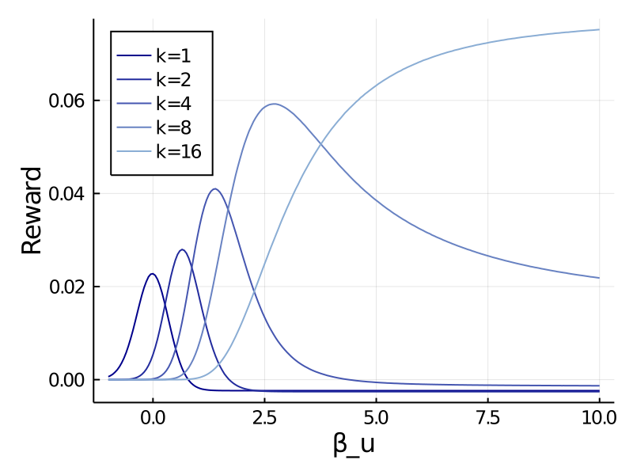
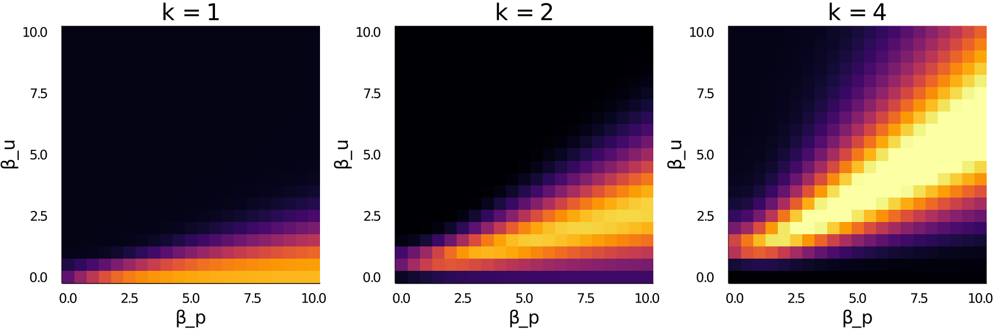

## Setup

Suppose you are given a basket containing $n$ balls with normally distributed values, $u_i$.

You can accept or reject the basket. If you reject, you get nothing. If you accept, I randomly draw $k$ balls (without replacement) and you get the best one. The probability of each ball being chosen is given by $p \sim \text{Dirichlet}(\mathbf{1})$. That is, the probability vector is sampled uniformly from the $n$-simplex.

Note that the value $k$ is an index of how much *control* you have over the environment. When $k=1$, you have no control; you simply get what you are given. When $k=n$, you have complete control, choosing whichever ball you want (presumably the one with maximal value). 

Before making a choice, you get to draw $s$ balls from the basket. One reasonable thing to do is to loook at the mean of those samples and accept the basket if the mean is greater than zero. Assuming you use this overall strategy, how should you decide which balls to sample? 

## Softmax (Bear et al. 2020)

Bear et al. (2020) suggest that (in some situations at least) you should consider outcomes that are both likely and valuable. Specifically, you should sample outcomes according to a multiplicative combination of their probabilities and a softmax of their values
$$f(i) \propto p_i e^{\beta u_i}$$

This equation actually defines a continuum of strategies. When $β = 0$, we revert to the default sampling strategy. As $β → \infty$, we ignore probability and only consider the best possible outcome. Here, we explore how a rational agent adapts their sampling strategy in response to how much control they have. Intuitively, the more control you have, the more you should focus on the highest values. And indeed, that is just what we see.

{width=70%}

## Softmax over value and probability

In the Bear model, the agent can control how much utility affects which samples are generated. When $β$ is high, probability is effectively ignored. However, this confounds two separate factors: (1) how much relative weight should we give to probability vs value and (2) how deterministic should our sampling be. We can thus augment the Bear model by putting a coefficient on probability as well. That is, 
$$f(i) \propto p_i^{β_p} e^{β_u u_i}$$

We can rewrite this to emphasize that we have a single softmax that has separate weights for (log) probability and utility: 
$$f(i) \propto e^{β_p \log(p_i) + β_u u_i}$$

Looking at the expected reward for a grid of these two parameters, we see that it is generally better to be more deterministic, but that the optimal relative weight on utility vs probability changes with the degree of control. Note that if we increased the number of samples relative to the total nubmer of balls, we would probably see that being too deterministic reduces reward. Also note that we can't interpret the diagonal here as being equally sensitive to utility and probability because they are not in the same units. I'm not sure how to quantify relative sensitivity here. One simple approach is to z-score utility and log probability. I think mutual information might provide a more principled approach, but I'm not sure how exactly that would work.

