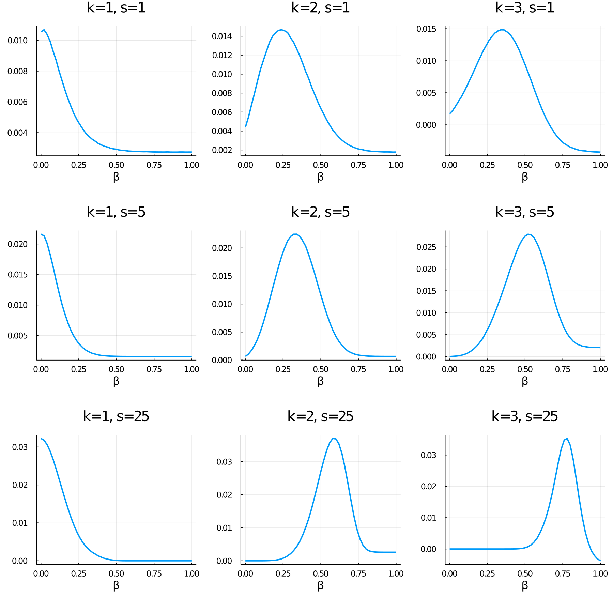
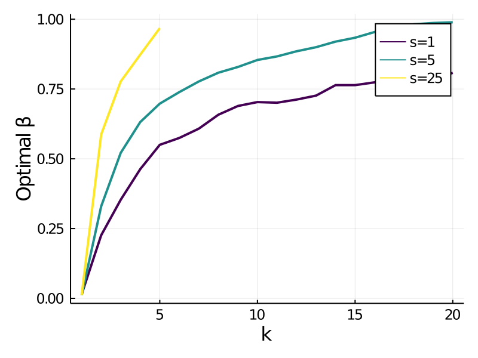
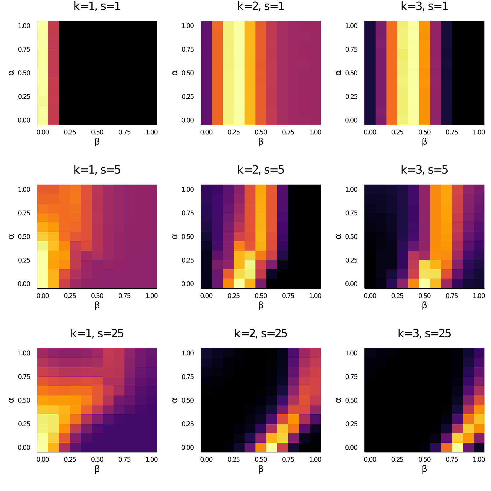

## Setup
(same as before)

Suppose you are given a basket containing $n$ balls with normally distributed values, $u_i$.

You can accept or reject the basket. If you reject, you get nothing. If you accept, I randomly draw $k$ balls (without replacement) and you get the best one.

Before making a choice, you get to draw $s$ balls from the basket. One reasonable thing to do is to look at the mean of those samples and accept the basket if the mean is greater than zero. Assuming you use this overall strategy, how should you decide which balls to sample?

## Model
We assume that the samples are drawn with probability proportional to their probability of occuring, multiplitied by a convex combination of exponentiated value and absolute value:
$$
f(i) \propto \big(p_i \cdot ((1 - β) |u_i| +\ β e^{u_i})\big)^d
$$
The parameter $d$ controls the sharpness or determinism of the sampling distribution. As $d$ increases, the sampling distribution gets sharper, eventually resulting in the single outcome that maximizes $f$ always being sampled. Note that this does not change the rank order of sampling probability.

After sampling $s$ outcomes, we reweight them to account for the sampling bias (as in importance sampling). To capture a range of strategies between simple biased sampling and full reweighting, we compute our "expected value" as
$$
\hat{u} = \frac{1}{s} \sum_{j\in\mathcal{S}} 
    \left(\frac{p_j}{f(j)}\right)^α \cdot u_j 
$$
where $\mathcal{S}$ is the set of outcomes we sampled and $α$ is a parameter that controls the degree of reweighting: $α = 1$ gives importance sampling, $α=0$ gives no reweighting, and intermediate values are, well, intermediate.

#### Parameter review

- $k$ is the degree of control (how many options you select from)
- $s$ is the number of samples you get to take
- $β$ controls the degree to which exponentiated (high) vs absolute (extreme) value affects sampling.
- $d$ controls the sharpness or determinism of the sampling distribution.
- $α$ controls the degree to which samples are reweighted to account for bias in the sampling distribution; $α=1$ corresponds to importance sampling.

## Results

### Reweighting bad; determinism good

Looking just at the reweighting and determinism parameters (optimizing $β$), we see that no reweighting and high determinism is always best. This motivates focusing on the case where  $α=0$ and $d=4$. Note that 4 is an arbitrary cutoff, but it looks like it won't get much better with higher values (see "a closer look at determinism").

### Higher control encourages sampling high-value outcomes

Setting $α=0$ and $d=4$, how does $k$ affect the optimal $β$?

- We see the basic prediction that sampling high-value outcomes is better as control increases. For these values of $k$ and $s$, the best value is always a compromise.
- More samples (higher $s$) also encourages more sampling of high vs. extreme outcomes. This could be an interesting thing to manipulate (time pressure).
- We see similar results if we optimize over $α$ and $d$, but there is a less steep drop off (because the model can weaken its bias when the bias is not set correctly).

<!--  -->

### A closer look at determinism

Eliminating reweighting ($α=0$), what is the effect of determinism?

- More deteminism is generally better; although the advantage falls off for extreme values (not shown here, but it actually starts to hurt if when $d = 10$).
- The optimal $β$ decreases for higher determinism. This could be because exponentiated value has higher variance than absolute value, and thus putting more weight on it will produce more deterministic sampling regardless of $d$. Separately controlling $d$ allows us to find the best tradeoff between absolute and exponentiated value without compromising along the determinism axis.

### A closer look at reweighting

Fixing $d=4$, what is the effect of $α$?

- For $s=1$, reweighting doesn't matter. This makes sense because all that matters is the decision is made based on the sign of the sample.
- In no case does reweighting improve performance (for the best $β$). It's surprising to me that reweighting is actually harmful in the $k=1$ case. I'm not sure how robust this will be to changes in the problem setup, in particular the underlying value distribution (Gaussian). Note that the goal of importance sampling is usually to minimize error in your estimate, whereas in our case you just need to get the sign right to make the correct choice.
- Note that we draw the same conclusions if we set $d=4$.

