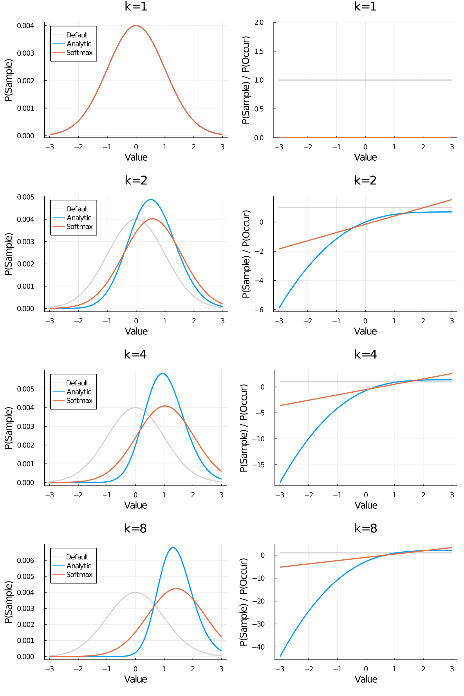
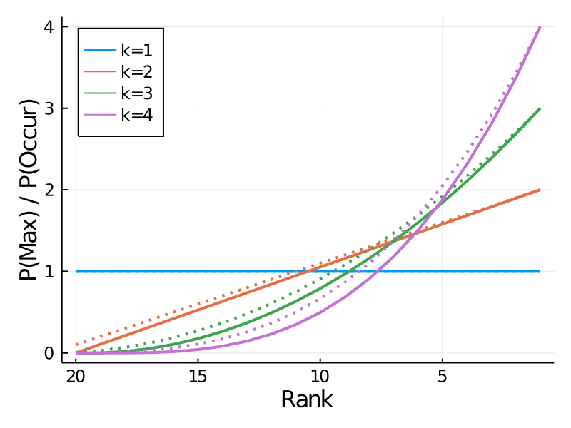

\DeclareMathOperator*{\E}{E}

## Setup

You are taking your afternoon stroll, when you suddenly come across an urn containing infinitely many balls of different value, following an unknown and very mysterious distribution, $p_U$. A stranger emerges from the shadows and offers a sinister gamble: choose $k$ balls from the urn and you can have the very best one... but you must keep it, no matter how unappealing the ball is! Fortunately, the stranger is not entirely unfair; he will allow you to pull $s$ "practice balls" out of the urn before making your decision.

## Model

<!-- And to make matters even trickier, this mysterious stranger is a trained economitrician, requiring you to first name the minimum amount you'd be willing to pay (using Becker-DeGroot-Marschak mechanism) -->

Here's the generative model:

$$
\begin{aligned}
u_i &\sim U \text{ for } i \text{ in } 1 \dots k \\
V &\sim \max_{i \in 1 \dots k} u_i
\end{aligned}
$$

$V$ is the value of the gamble. So our goal is to estimate whether $\E[V] > 0$. We will do this by sampling. The simplest approach is Monte Carlo. Generate a set of $k$ samples, take the maximum, and we have one sample of $V$. However, this is inefficient. We can only draw $s$ balls, so we get $s/k$ samples.

What if we could instead sample directly from $p_V$, that is from the distribution of the maximum of $k$ samples? It turns out that this distribution has the following PDF:

$$
p_V(x) = k p_U(x) \cdot F_U(x)^{k-1}
$$
To see why, we can break up the probability into two pieces (which are separated by the dot). The first term is the probability that we sample the value $x$ at all in the set. Because the samples are independent and the probability of sampling the same value twice is infinitesimal,^[is this technically correct?] this is just $k$ times the probability of sampling it once. The second term captures the probability that $x$ is the _maximum_ in the set. This would be true iff all the other values are less than $x$. By definition, the CDF $F_U(x)$ gives the probability that one sample is less than $x$. We simply raise this to the power $k-1$ because all $k-1$ of the other samples need to be below $x$ for $x$ to be the maximum.

Assuming we can sample from this distribution, we can now estimate the value of the gamble by a simple mean of the samples,

$$
\begin{aligned}
x_i &\sim p_V \text{ for } i \text{ in } 1 \dots s \\
\E[V] &\approx \sum_{i=1}^s x_i
\end{aligned}
$$

It's useful at this point to think about how $p_V$ differs from $p_U$. We assume that we can "by default" sample directly from $p_U$, so the difference tells us how we should bias our samples. Concretely, we can define our bias function as

$$
\text{bias}(x) = \frac{p_V(x)}{p_U(x)} = k F_U(x)^{k-1}
$$

And here's what that looks like, assuming $U \sim \text{Normal}(0, 1)$. 

## Comparison to Bear (2020)

This curve is importantly different from the softmax model of Bear (2020)---and by extension, our previous model. The Bear model is defined

$$
\text{SM}(x) \propto p_U(x) e^{\frac{x}{\tau}} + C
$$

The key difference is that the sampling bias of analytic model (the right panel below) has a sigmoidal shape whereas the Bear model has an exponential shape.^[It is very natural at this point to object: "But wait, the weights will eventually be normalized (hence the name softmax). Given that the softmax is basically a logistic generalized to non-binary decisions, shouldn't it produce sigmoidal bias curves as well?" The main differences are that in the analytic model, the sigmoidal curve is applied separately to each value and the curve saturates at $kp$. In contrast, the softmax is applied once to the whole set of outcomes, and it necessarily saturates at 1 (i.e. alway sampling the best value).]
The two functions thus diverge for very high values. For non-extreme values, however, the models make quite similar predictions; so it might be hard to tease them apart. I have the data from Bear (2020) and will have model comparison results soon.

## Adding UWS

We can add utility-weighted sampling to the model by simply tacking on another term:

$$
q(x) = k p_U(x) \cdot F_U(x)^{k-1} \cdot \big\vert x - \E[V]\big\vert 
$$

When we take the mean of our samples from $q$, we will reweight them by the UWS term only, so we'll have

$$
\E[V] \approx \sum_{i=1}^s \frac{1}{\big\vert x_i - \E[V]\big\vert}x_i
$$

This equation makes it painfully obvious that we are using $\E[V]$ as part of our strategy for estimating $\E[V]$. As discussed in Lieder et al. (2018), this term will have to be replaced by an approximation, e.g. the "average utility [...] of the outcomes of previous decisions made in a similar context". More on this below.

### Extreme vs good

As expected, we see that high values are sampled more as $k$ increases. However, we also see an increase in absolute values, so there isn't exactly an extreme vs. positive _tradeoff_ as we had in the previous model. I think if we want to see that, we might need to assume a negatively skewed distribution, (which will be interesting for other reasons).

### Unrealistic presupposed information
The analytic model presupposes two pieces of information that we wouldn't reasonably have about the infinite urn: the cumulative density function and (if we apply UWS) the expected maximum itself. The latter is more obviously problematic, but there are reasonable approximations. The simplest approach taken by the earlier version of UWS (Lieder et al. 2014) is to drop $\E[V]$ entirely (i.e weighting by $|x|$). This is perhaps not unreasonable if our goal is to estimate whether $\E[V] > 0$. Lieder et al. (2018) suggest that an approximation could be made based on our previous encounters with mystical urns (similar decision contexts).

The cumulative density function is not so obviously problematic, but my intuition (which I can't really justify) is that assuming the CDF is almost as bad, at least in the infinite urn case. This problem can probably be addressed in the same way as the previous one: assume the agent has learned a CDF for urns in general, which may not exactly match the current urn.

## Application to finite sets
As useful as the urn model is for building intuition and theory, I think we ultimately want a model that applies to finite sets of outcomes (as in the original N choose K model). There are at least two ways to apply the insights above to the finite case. Both basically take the "limiting case analysis" approach. We've derived the "optimal" sampling strategy for the infinite urn: maybe we can apply the same equation to a tremendously large urn (where the approximation will be very close) or even your run of the mill medium-sized urn.

### Using the Gaussian $p_V$ as a weighting function

Given a set of outcomes, we can score each one by $p_V$ or $\text{SM}$, re-normalize, and sample from the outcomes according to those weights. That is, we can use it in the place of $f$ from the previous model. If the values are normally distributed, the sampling probabilities look nearly the same as the plots above. The match is exact as $n \rightarrow \infty$, but it is already very close at $n=4$ (for $k=2$).

A nice thing about this approach is that we can easily apply the previously mentioned solutions to both unrealistic presupposed information problems. We can assume that the agent has learned the CDF and the expected maximum for the outcomes of similar actions she has taken in the past. Because each outcome set is distinct, we can even assume the true values for both (avoiding adding extra parameters) without giving the agent perfect information about each individual decision she faces.

### Approximating $p_V$ for a given outcome set

An alternative approach is to use the empirical CDF of the given set of outcomes. This corresponds to assuming that the agent can sample outcomes according to their negative order, which is a little iffy but is not entirely unreasonable.

Interestingly, we find that the optimal sampling bias looks quite exponential with the (negative) rank of the value. A nice thing about this analysis is that it is distribution-free. The plot below holds for an arbitrary set of outcomes. Note that the expression for $p_V$ above is not exact in this case because it does not capture sampling with replacement.

## Coming soon to an inbox near you

- Expected reward comparisons of Bear (2020), the analytic model, and our previous mixture model.
- Model comparison on Bear (2020) data with the same three models

<!--                    -->

